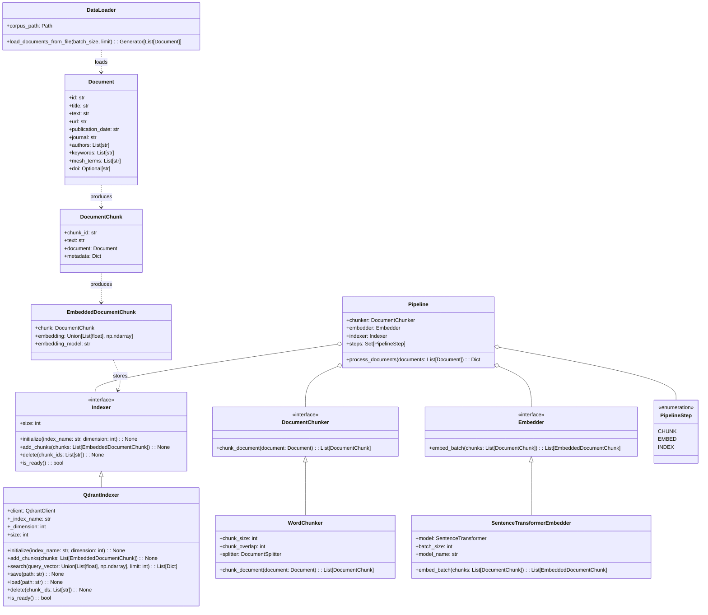

```mermaid
classDiagram
    %% Data Classes
    class Document {
        +id: str
        +title: str
        +text: str
        +url: str
        +publication_date: str
        +journal: str
        +authors: List[str]
        +keywords: List[str]
        +mesh_terms: List[str]
        +doi: Optional[str]
    }

    class DocumentChunk {
        +chunk_id: str
        +text: str
        +document: Document
        +metadata: Dict
    }

    class EmbeddedDocumentChunk {
        +chunk: DocumentChunk
        +embedding: Union[List[float], np.ndarray]
        +embedding_model: str
    }

    %% Interfaces
    class Indexer {
        <<interface>>
        +initialize(index_name: str, dimension: int): None
        +add_chunks(chunks: List[EmbeddedDocumentChunk]): None
        +size: int
        +delete(chunk_ids: List[str]): None
        +is_ready(): bool
    }

    %% Interfaces
    class DocumentChunker {
        <<interface>>
        +chunk_document(document: Document): List[DocumentChunk]
    }

    class Embedder {
        <<interface>>
        +embed_batch(chunks: List[DocumentChunk]): List[EmbeddedDocumentChunk]
    }

    %% Implementations
    class WordChunker {
        +chunk_size: int
        +chunk_overlap: int
        +splitter: DocumentSplitter
        +chunk_document(document: Document): List[DocumentChunk]
    }

    class SentenceTransformerEmbedder {
        +model: SentenceTransformer
        +batch_size: int
        +model_name: str
        +embed_batch(chunks: List[DocumentChunk]): List[EmbeddedDocumentChunk]
    }

    class QdrantIndexer {
        +client: QdrantClient
        +_index_name: str
        +_dimension: int
        +initialize(index_name: str, dimension: int): None
        +add_chunks(chunks: List[EmbeddedDocumentChunk]): None
        +size: int
        +search(query_vector: Union[List[float], np.ndarray], limit: int): List[Dict]
        +save(path: str): None
        +load(path: str): None
        +delete(chunk_ids: List[str]): None
        +is_ready(): bool
    }

    %% Pipeline Components
    class PipelineStep {
        <<enumeration>>
        CHUNK
        EMBED
        INDEX
    }

    class DataLoader {
        +corpus_path: Path
        +load_documents_from_file(batch_size, limit): Generator[List[Document]]
    }

    %% Pipeline
    class Pipeline {
        +chunker: DocumentChunker
        +embedder: Embedder
        +indexer: Indexer
        +steps: Set[PipelineStep]
        +process_documents(documents: List[Document]): Dict
    }

    %% Inheritance
    DocumentChunker <|-- WordChunker
    Embedder <|-- SentenceTransformerEmbedder
    Indexer <|-- QdrantIndexer

    %% Composition
    Pipeline o-- DocumentChunker
    Pipeline o-- Embedder
    Pipeline o-- Indexer
    Pipeline o-- PipelineStep

    %% Relationships
    Document ..> DocumentChunk : produces
    DocumentChunk ..> EmbeddedDocumentChunk : produces
    EmbeddedDocumentChunk ..> Indexer : stores
    DataLoader ..> Document : loads
```
