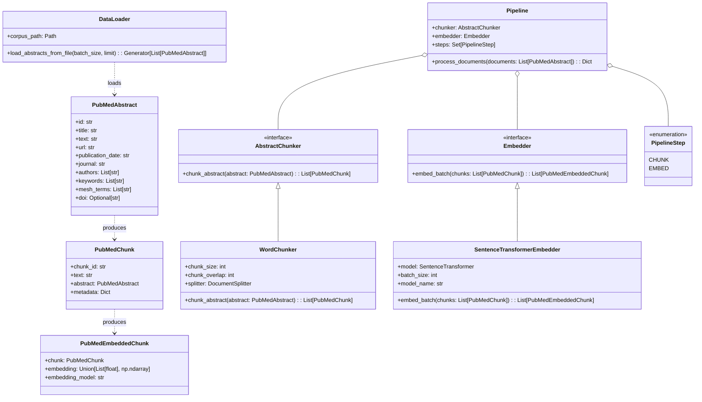

```mermaid
classDiagram
    %% Data Classes
    class PubMedAbstract {
        +id: str
        +title: str
        +text: str
        +url: str
        +publication_date: str
        +journal: str
        +authors: List[str]
        +keywords: List[str]
        +mesh_terms: List[str]
        +doi: Optional[str]
    }

    class PubMedChunk {
        +chunk_id: str
        +text: str
        +abstract: PubMedAbstract
        +metadata: Dict
    }

    class PubMedEmbeddedChunk {
        +chunk: PubMedChunk
        +embedding: Union[List[float], np.ndarray]
        +embedding_model: str
    }

    %% Interfaces
    class AbstractChunker {
        <<interface>>
        +chunk_abstract(abstract: PubMedAbstract): List[PubMedChunk]
    }

    class Embedder {
        <<interface>>
        +embed_batch(chunks: List[PubMedChunk]): List[PubMedEmbeddedChunk]
    }

    %% Implementations
    class WordChunker {
        +chunk_size: int
        +chunk_overlap: int
        +splitter: DocumentSplitter
        +chunk_abstract(abstract: PubMedAbstract): List[PubMedChunk]
    }

    class SentenceTransformerEmbedder {
        +model: SentenceTransformer
        +batch_size: int
        +model_name: str
        +embed_batch(chunks: List[PubMedChunk]): List[PubMedEmbeddedChunk]
    }

    %% Pipeline Components
    class PipelineStep {
        <<enumeration>>
        CHUNK
        EMBED
    }

    class DataLoader {
        +corpus_path: Path
        +load_abstracts_from_file(batch_size, limit): Generator[List[PubMedAbstract]]
    }

    %% Pipeline
    class Pipeline {
        +chunker: AbstractChunker
        +embedder: Embedder
        +steps: Set[PipelineStep]
        +process_documents(documents: List[PubMedAbstract]): Dict
    }

    %% Inheritance
    AbstractChunker <|-- WordChunker
    Embedder <|-- SentenceTransformerEmbedder

    %% Composition
    Pipeline o-- AbstractChunker
    Pipeline o-- Embedder
    Pipeline o-- PipelineStep

    %% Relationships
    PubMedAbstract ..> PubMedChunk : produces
    PubMedChunk ..> PubMedEmbeddedChunk : produces
    DataLoader ..> PubMedAbstract : loads
```
