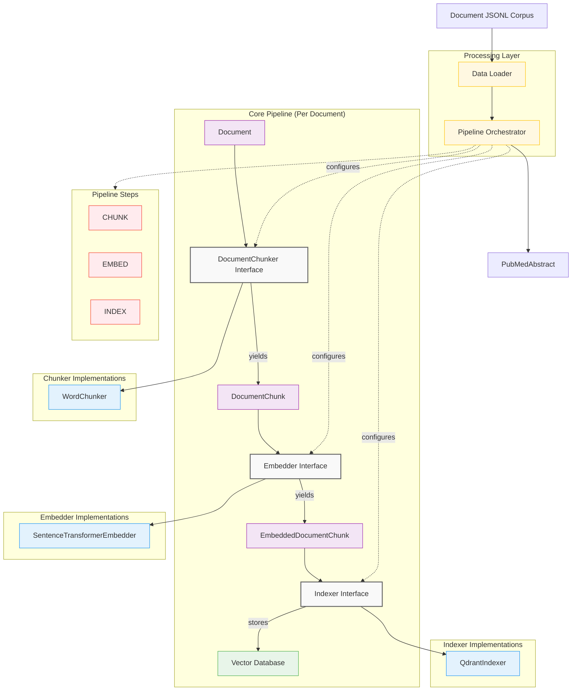

```mermaid
graph TD
    InputData[Document JSONL Corpus]

    subgraph ProcessingLayer["Processing Layer"]
        DataLoader[Data Loader]
        Pipeline[Pipeline Orchestrator]
    end

    subgraph CorePipeline["Core Pipeline (Per Document)"]
        direction LR

        DocumentChunkerInterface[DocumentChunker Interface]
        EmbedderInterface[Embedder Interface]
        IndexerInterface[Indexer Interface]

        Document[Document] --> DocumentChunkerInterface
        DocumentChunkerInterface --> |"yields"| DocumentChunk[DocumentChunk]
        DocumentChunk --> EmbedderInterface
        EmbedderInterface --> |"yields"| EmbeddedDocumentChunk[EmbeddedDocumentChunk]
        EmbeddedDocumentChunk --> IndexerInterface
        IndexerInterface --> |"stores"| VectorDB[Vector Database]
    end

    subgraph ChunkerImplementations["Chunker Implementations"]
        direction TB
        DocumentChunkerInterface --> WordChunker[WordChunker]
    end

    subgraph EmbedderImplementations["Embedder Implementations"]
        direction TB
        EmbedderInterface --> SentenceTransformerEmbedder[SentenceTransformerEmbedder]
    end

    subgraph IndexerImplementations["Indexer Implementations"]
        direction TB
        IndexerInterface --> QdrantIndexer[QdrantIndexer]
    end

    InputData --> DataLoader
    DataLoader --> Pipeline
    Pipeline --> PubMedAbstract

    %% Pipeline Configuration
    Pipeline -.-> |"configures"| DocumentChunkerInterface
    Pipeline -.-> |"configures"| EmbedderInterface
    Pipeline -.-> |"configures"| IndexerInterface

    %% Pipeline Steps
    subgraph PipelineSteps["Pipeline Steps"]
        PipelineChunk[CHUNK]
        PipelineEmbed[EMBED]
        PipelineIndex[INDEX]
    end

    Pipeline -.-> PipelineSteps

    classDef interface fill:#f9f9f9,stroke:#666,stroke-width:2px
    classDef implementation fill:#e3f2fd,stroke:#2196f3
    classDef storage fill:#e8f5e9,stroke:#4caf50
    classDef process fill:#fff8e1,stroke:#ffc107
    classDef data fill:#f3e5f5,stroke:#9c27b0
    classDef step fill:#ffebee,stroke:#f44336

    class DocumentChunkerInterface,EmbedderInterface,IndexerInterface interface
    class WordChunker,SentenceTransformerEmbedder,QdrantIndexer implementation
    class VectorDB,FileSystem storage
    class DataLoader,Pipeline process
    class Document,DocumentChunk,EmbeddedDocumentChunk data
    class PipelineChunk,PipelineEmbed,PipelineIndex step
```
